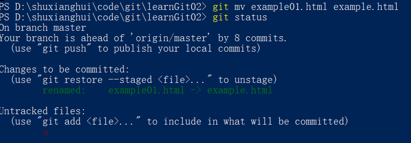
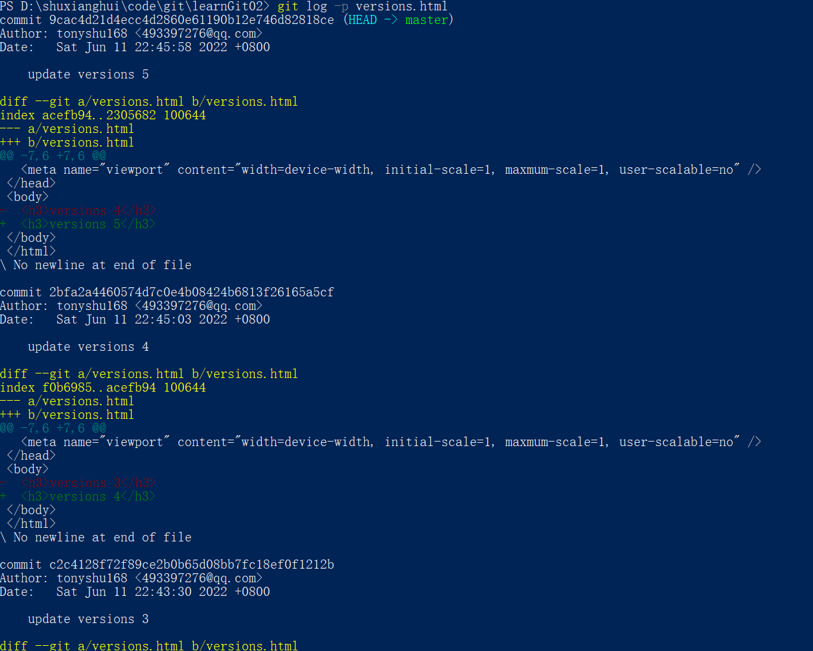
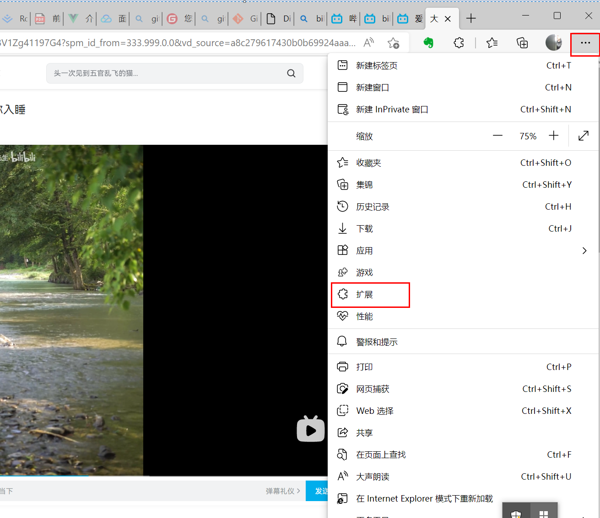
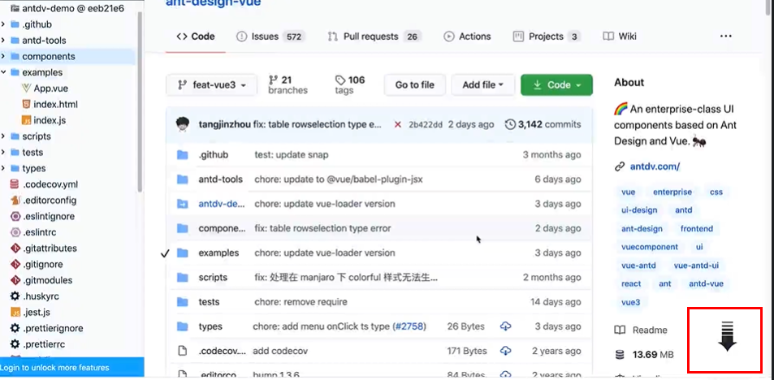

# Git manual

### Git安装
1. 检查当前电脑是否已安装git, 进入命令行输入如下命令*git version*，如有没报错，说明已安装，否则没安装。
2. windows安装:
    * 进入[git](https://git-scm.com/)官网下载你window对应的版本(32位还是64位)git，再一路下一步即可。
    
    * 安装完后，在桌面单击鼠标右键，菜单栏中出现"Git GUI Here"与"Git Bash Here"说明安装成功。<br />
     
3. MacOs安装:
    * 同样进入[git](https://git-scm.com/)官网，按照macOs安装方式安装即可。
    

### Github账号注册
进入到[github官网](https://github.com)，点击右上角"Sign Up"按钮注册账号，按要求填写好你的登录email, 账号与密码。

### 仓库概念与创建仓库
* 仓库: 管理项目的目录
* 创建仓库: 登录到github上，点击"Repositories"，再点击"New"创建新仓库，填写对应的信息，新仓库创建成功。


### 将代码上传到github
1. 在本地创建一目录，如learnGit02, 初始化本地目录，命令行: git init。
```bash
git init
```
2. 新建index.html文件，命令行: git add ., git commit -m 'add index.html file'
```bash
git add .
git commit -m 'add index.html file'
```

3. 进入githuh中新创建仓库中，”…or create a new repository on the command line“这项最后两行命令在本地执行。


### 找到所有操作记录的操作
1. git status: 查看当前项目有那些修改。
输入git status，如出现nothing to commit, 说明我们没做任何修改。<br />
 <br />
在index.html文件中添加一行: <h3>index.html</h3>，输入: git status <br />


2. git log: 查看当前项目的提交记录 <br />
 <br />
查看某人的提交记录: git log --author="xxx"

### 配置用户名与email
1. git config --global user.name 'xxxx'
2. git config --global user.email 'xxxx@qq.com'
验证当前配置: git config --global --list

### 修改项目中的文件
1. 在index.html文件中添加一行“<h3>添加内容</h3>”，保存。
2. git add index.html
3. git commit -m "index.html add row content";

### 删除不需要的文件
* 手动删除: 
    1. 新加example.html文件， git add example.html, git commit -m "add example.html file".
    2. 手动删除example.html文件，git add ., 查看删除状态: git status。<br />
     <br />
    3. git commit -m "手动删除example.html"，查看删除记录: git log <br/>
     <br/>
* 命令行删除:
    1. 重新添加example.html, git add example.html, git commit -m "重新添加example.html文件"。
    2. git rm example.html. <br/>
     <br/>
    3. git add ., git commit -m "命令行删除文件"

### 文件重命名操作
* 手动重命名: 
    1. 重新添加example.html文件
    2. 手动将example.html文件改为example01.html文件 <br/>
     <br/>
    3. git add exmaple01.html, git rm example.html <br/>
     <br/>
    4. git commit -m "手动命名" <br/>
     <br/>
* 命令行重命名:
    1. git mv example01.html example.html, git status <br/>
     <br/>
    2. git commit -m "命令行重命名" <br/>
     <br/>

### 移动文件到其它位置操作
* 移动文件到其它位置
    1. 新建文件夹home，命令行输入: git mv exmaple.html home <br/>
     <br/>
    2. git commit -m "移动文件example.html到home文件夹"

* 移动文件到其它目录并重命名
    1. 在根目录下创建demo.html，并提交。
    2. git mv demo.html home/home.html. <br/>
     <br/>
    3. git commit -m "移动文件demo.html到home文件夹，并命名为home.html" <br/>
     <br/>

### 文件有变化时查看文件前后变化
* 方法1：
    1. git log --pretty=oneline home/home.html, 复制提交的id。 <br/>
     <br/>
    2. git show ac363ff21e93d6d023eee890ae53b7d73d83045b, 可以查看这次提交记录。 <br/>
     <br/>

* 方法2:
    1. 查看文件具体的修改内容：git log -p home/home.html <br/>
    

### 操作失误的情况如保实现一键复原
* 方法1: 
    1. 在index.html中做修改，在命令行输入git diff可以查看文件具体修改。<br/>
     <br/>
    2. 查看修改，手动改回原来的内容。

* 方法2:
    1. 在index.html中做修改，在命令行输入git status查看那些文件修改了。 <br/>
     <br/>
    2. git checkout -- index.html，可还原修改之前的状态。 <br/>
     <br/>

### 不再追踪时如何撤销追踪操作
1. 在index.html中修改，再git add index.html，这时无法用checkout来还原。 <br/>
 <br/>
2. git reset HEAD index.html: 对index.html文件取消追踪。<br />
 <br/>
3. git checkout -- index.html还原。

### 回到上一版本或指定版本的操作
1. 新建一个versions.html文件，命令行输入: git add versions.html, git commit -m "add versions.html"。 <br/>

2. 将versions.html中"versions 1"改为"versions 2"，并输入git add versions.html，git commit -m "updata versions 2"，最后将"versions 2"更新到"versions 3", "versions 4", "versions 5"。 <br/>
 <br/>
3. 退回上版本: git reset --hard HEAD^, "^"表示回到上一次版本，"^^"表示回到上两个版本，"^n"回到上n个版本。 <br/>
 <br/>
4. 修改versions.html中"versions 4"改成"versions 5"，git add versions.html, git commit -m "update versions 5"。 <br/>
 <br/>
5. 通过git log --pretty=oneline versions.html，获取所有版本记录，指定回退到具本版本: git reset --hard c2c4128, 'c2c4128'为版本id也就是commit id, 可取前7到8位或全部。 <br/>
 <br/>

### 将某一文件回到指定版本
1. 将versions.html版本由3更新到versions 4，并提交记录，只到提交录为5。<br/>
 <br/>
2. 在index.html文件中添加一行"<h3>versions 5内容</h3>", 命令行: git add index.html, git commit -m "index.html 添加一行'<h3>versions 5内容</h3>'"。
3. 命令行输入: git log，查看所有的提交记录，并复制versions.html想要回到某一提交记录的id.
4. 命令行输入: git checkout c2c4128 -- versions.html <br />
 <br/>
 <br />

### 修改内容后推送至远程仓库
1. 将之前的提交记录推送到远程仓库，命令行输入: git push origin master, 并可在远程仓库查看。<br />
 <br/>

### 给版本创建一个独特标签，所有版本标签管理操作
* 创建一个"标签"(默认在最近一次提交上创建标签)，命令行输入: git tag v1.0.0 <br/>
 <br />
    查看当前"标签"是否成功, 有两种方法: 1: git log, 2: git tag。

* 在指定的提交记录上创建"标签"。
    1. 输入git log查看提交记录，并复制指定提交记录的id。
    2. 输入: git tag v0.5.0  c2c4128f。
    3. 查看创建"标签": git tag。 <br />
     <br />

* 删除之前创建的"标签": git tag -d v0.5.0 <br />
 <br/>

* 将"标签"推送到远程仓库: git push origin v1.0.0 <br />
 <br>
<br />
 <br />


*** 

## 分支操作  
    几乎所有的版本控制系统都以某种形式支持分支。 使用分支意味着你可以把你的工作从开发主线上分离开来，以免影响开发主线。 在很多版本控制系统中，这是一个略微低效的过程——常常需要完全创建一个源代码目录的副本。对于大项目来说，这样的过程会耗费很多时间。

    有人把 Git 的分支模型称为它的“必杀技特性”，也正因为这一特性，使得 Git 从众多版本控制系统中脱颖而出。 为何 Git 的分支模型如此出众呢？ Git 处理分支的方式可谓是难以置信的轻量，创建新分支这一操作几乎能在瞬间完成，并且在不同分支之间的切换操作也是一样便捷。 与许多其它版本控制系统不同，Git 鼓励在工作流程中频繁地使用分支与合并，哪怕一天之内进行许多次。 理解和精通这一特性，你便会意识到 Git 是如此的强大而又独特，并且从此真正改变你的开发方式。

### 分支的创建，切换，删除操作
* 创建分支
    * 创建dev分支: git branch dev, 查看当前创建的分支: git branch。 <br />
     <br/>

    * 创建test分支: git branch test。

* 切换分支:
    * 切换到dev分支: git checkout dev, 查看到当前分支是否切换成功: git branch。 <br/>
     <br/>

* 删除分支(不能删除当前分支): git branch -d dev
    1. 输入: git branch -d dev (删除不了当前分支)
    2. 删除test分支: git branch -d test <br/>
     <br/>

    * 如要删除的分支有commit，使用git branch -d 分支，也是删除不掉了，需要将-d改为D强制删除。
        1. 切换到test分支: git checkout test, 添加text.html文件, 并commit。
        2. 将分支换到dev, 输入: git branch -d test，将会报错。 <br />
         <br/>
        3. 强制删除分支: git branch -D test。 <br/>
         <br/>

* 创建分支并切换到新创建的分支:
    1. 输入: git checkout -b test <br/>
     <br />


### 分支合并的操作
1. 在当前分支dev上创建index.css, index.js文件，并在index.html引用这俩文件，并输入: git add .; git commit -m "新加index.css, index.js两文件在dev分支上"。<br />
 <br/>

2. 切换到master分支； git checkout master

3. 合并dev分支: git merge dev <br/>
 <br/>

### 分支合并有冲突时如何正确的合并分支
1. 在master分支中index.html中最后一行添加一行"<h3>master分支代码</h3>", 并输入: git add index.html; git commit -m "master分支修改index.html内容"

2. 切换到dev分支，在index.html中最后一行添加一行"<h3>dev分支代码</h3>"，并输入: git add index.html; git commit -m "dev分支修改index.html内容"。

3. 再切回master分支，合并dev分支: git merge dev，冲突报错。 <br/>
 <br/>
 <br/>

4. 冲突处理:
    1. 方法1解决冲突，输入: git merge --abort(冲突时保留当前分支的代码)， 冲突解决。 <br/>
     <br/>
    2. 方法2解决冲突, 合并dev分支: git merge dev，报错代码冲突。<br />
     <br/>
     <br/>
    3. 在index.html中手动删除<<<<<< HEAD, ========, >>>>>>>> dev这些特殊符号，保存你想的内容。 输入: git add index.html, git commit， 可在commit编辑提交说明 <br />
     <br/>

### 不同人查看版本路线操作
1. 查看当前分支提交全部简单信息记录: git log --oneline。 <br/>
 <br/>

2. 查年当前分支版本路线: git log --oneline --graph。 <br/>


### 删除不想要的远端分支操作
1. 在本地创建并切换到test分支：git branch -b test <br/>
 <br/>

2. 在远程(github或gitee)上基于master创建两个分支dev_tony, summer两个分支。 <br/>
 <br />

3. 同步远端分支: git fetch <br />
 <br/>

4. 删除远端分支summer(确定要删除的分支已合并，并真正认为不想要了), 输入: git push origin --delete summer <br/>
 <br />

 <br />

### 团队合作时，不同人修改不同文件时及推送的操作
1. 将分支切换到master分支: git checkout master, 在index.html中添加一行"<h3>master分支最后一行添加的代码</h3>"保存，再输入: git add index.html, git commit -m "在master分支中的index.html最后一行添加的代码"。 <br />
 <br/>

2. 用别外一账号登录并编辑当前项目, 在example.html文件最后一行添加" <h3>别人添加的内容</h3>"，提交并摄像头到远端仓库。 <br />
 <br />

3. 再用自己的账号编辑当前项目，输入: git push后报错，因为别人也做了不同文件的修改，因此在推送之前需要先同步远端代码。<br/>
 <br/>

4. 我们可以用: git pull origin master 或 git fetch origin master; git merge origin/master, 再推送到远端: git push <br/>
 <br/>

### 创建分支并关联远端分支
1. 在远端基于master分支创建dev_01分支，并在exmaple.html body中最后一行添加"<h3>远端dev_01分支</h3>"。 <br/>
 <br/>

2. 在本地创建分支dev_01并关联远端分支dev_01, 输入git fetch同歩远端所有分支，输入git branch -av查看本地与远端分支，并复制"remotes/origin/dev_01"。 <br />
 <br />

3. 创建分支并关联远端分支，输入: git checkout -b dev_01 remotes/origin/dev_01。 <br />
 <br />

***

## github,gitee拓展(讲解以edge为例)

### 插件ocotree初装(github可以以树形目录方式查看)
1. 打开edge浏览器, 点击右上角的【...】，菜单栏中点击【扩展】，再点击【管理扩展】。<br />
 <br />
 <br />

2. 进入到【扩展管理】页面，点击【获取Microsoft Edge扩展】。<br />
 <br />

3. 在搜索栏输入ocotree回车, 在搜索结果中点击右边的【获取】，即安装成功。 <br />
 <br />

4. 打开github左边有了树形的目录面板。 <br />


### 插件giteetree安装方式同上(gitee可以以树形目录方式查看) <br />
 <br />

### 插件enhanced github安装方式同上(可以查看单个文件大小，下载单个文件) <br />
 <br />

### 插件gitzip for github安装方式同上(双击某一目录可下载) <br />
 <br />


